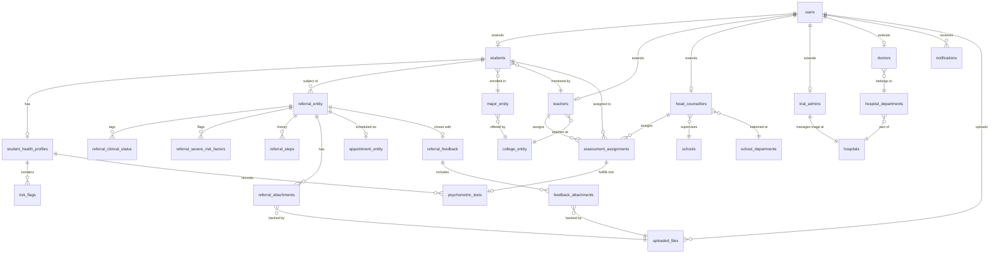

# Product Requirements Document (PRD)

# University Medical Screening & Psychiatric Referral System
**Document Version**: 1.0.0  
**Status**: Ready / Active Development  
**Last Updated**: 2026-08-02  

---

## 1. Executive Summary

The **University Medical Screening & Psychiatric Referral System** is an enterprise full-stack healthcare coordination platform designed to bridge university mental health departments with partner psychiatric hospitals and clinics. The platform establishes a structured, secure, and auditable pipeline for student mental health screening, risk tiering, on-campus counseling review, hospital triage, appointment scheduling, and clinical feedback integration.

By connecting five distinct stakeholder groups—**Students**, **Teachers/Counselors**, **Head Councillors (Counseling Directors)**, **Hospital Triage Admins**, and **Psychiatrists/Doctors**—the system eliminates fragmented manual communications, ensures strict data privacy under healthcare regulations, and accelerates critical psychological intervention workflows.

The primary MVP goal is delivering a reliable, end-to-end referral state machine accompanied by interactive psychological psychometrics (PHQ-9, GAD-7, SCL-90), automated multi-role notification routing, real-time risk dashboards, and a non-disruptive floating creation overlay.

---

## 2. Mission & Core Principles

### Mission Statement
To protect and improve university student mental health outcomes by providing an intuitive, transparent, and secure digital collaboration platform that seamlessly connects on-campus psychological monitoring with specialized psychiatric hospital care.

### Core Principles
1. **Student Privacy First (Zero Data Leakage)**: Clinical diagnoses and psychiatric histories are strictly isolated using fine-grained row-level visibility policies. Unassigned staff cannot view confidential medical data.
2. **Clinical Accountability & Auditability**: Every step in a referral’s lifecycle—from initial counselor observation to hospital discharge feedback—is recorded with immutable timestamps, actor IDs, and transition rationale.
3. **Frictionless Workflow for Educators and Clinicians**: Forms and triage workflows must be efficient, featuring non-modal multi-draft drawers and floating docks so users never lose in-progress clinical notes.
4. **Decoupled Architecture**: Domain business logic, database persistence schemes, and authentication mechanisms remain decoupled to support future scale, compliance changes, and infrastructure upgrades.

---

## 3. Target Users & Personas

| Persona | Role in System | Technical Comfort | Key Needs & Pain Points |
| :--- | :--- | :--- | :--- |
| **Student** | Assessment subject & patient | High (Mobile/Web) | - Needs a private, stigma-free way to take assessments.<br>- Wants clear visibility into referral statuses without feeling exposed.<br>- Needs appointment details and doctor notes accessible in one place. |
| **Teacher / Counselor** | Class-level monitor & initiator | Moderate | - Needs early warning indicators for high-risk students in their class.<br>- Needs a simple way to escalate critical cases to the psychological counseling center.<br>- Frustrated by paper-based referrals and lack of progress visibility. |
| **Head Councillor (Director)** | University gatekeeper & triage lead | Moderate to High | - Audits teacher referrals and decides hospital routing.<br>- Needs aggregate school-wide risk analytics and crisis intervention metrics.<br>- Reviews doctor feedback before closing case files. |
| **Hospital Triage Admin** | Healthcare coordinator | High | - Receives incoming university referrals.<br>- Matches student conditions with hospital departments and available specialists.<br>- Manages clinician workload distribution. |
| **Psychiatrist / Doctor** | Healthcare provider | High | - Needs comprehensive student assessment histories and counselor notes prior to intake.<br>- Requires structured clinical feedback submission (diagnosis, medication, treatment plans).<br>- Needs schedule management for psychiatric appointments. |

---

## 4. MVP Scope

### In Scope (MVP) ✅
- ✅ **Core Referral State Machine**: Complete lifecycle (`DRAFT` ➔ `AWAITING_APPROVAL` ➔ `AWAITING_TRIAGE` ➔ `WAITING_FOR_SCHEDULING` ➔ `WAITING_FOR_APPOINTMENT` ➔ `AWAITING_FEEDBACK_APPROVAL` ➔ `CLOSED`), with support for `REJECTED`, `RECALLED`, and `NEEDS_REASSIGNMENT`.
- ✅ **Role-Based Orchestration**: Five dedicated portal interfaces for Student, Teacher, Head Councillor, Trial Admin, and Doctor.
- ✅ **Creation Overlay & Minimized Dock**: Floating multi-step drawer supporting minimization into a bottom dock chip without losing draft data.
- ✅ **Psychological Assessment & Assignment Suite**:
  - Curated standardized psychometric catalog (PHQ-9, GAD-7, SCL-90, SDS, SAS) with validated clinical scoring algorithms.
  - Dual assignment pathways: 1-on-1 student assignment by Teachers/Head Councillors, and bulk cohort assignment (by major/class) by Head Councillors/Teachers.
  - Strict assignment-only student access: Students only take tests assigned to them, and only view task metadata (e.g. assigned date, completion status).
  - Confidential clinical evaluation: Raw scores, risk tiers (`LOW`, `MEDIUM`, `HIGH`), and symptom flags update `StudentHealthProfile` and are strictly restricted to educators/doctors.
  - High-risk alert routing: Automated notification dispatch to educators upon critical score thresholds without automatically bypassing counselor triage.
- ✅ **Student Health Profile & Risk Tracking**: Real-time risk tier calculation (`LOW`, `MEDIUM`, `HIGH`) and severe symptom flagging (e.g. self-harm ideation, acute psychosis).
- ✅ **File Upload & Asset Storage Suite**:
  - Profile Avatar upload & referencing (JPEG, PNG, WebP) with user avatar personalization.
  - Clinical Referral & Feedback Attachments (PDF, DOCX, DOC, JPEG, PNG) attached by Teachers, Head Councillors, and Doctors during referral creation and clinical feedback.
  - Security validation: Strict MIME-type whitelisting and size constraints (5MB for avatars, 25MB for clinical documents).
  - Dual access tier: Publicly cached static avatars vs. strictly authenticated and row-level permission checked streaming endpoints for clinical documents.
- ✅ **Notification Routing Engine**: Asynchronous transactional event listener routing notifications to exact recipients based on state transitions and high-risk assessment submissions.
- ✅ **Visual Referral Tracker**: Step-by-step audit trail showing timeline nodes, actors, timestamps, and issue notes.
- ✅ **Row-Level Visibility Enforcement**: Backend policy layer ensuring strict privacy filtering on all SQL queries.

### Out of Scope (Deferred to Post-MVP) ❌
- ❌ Custom/arbitrary questionnaire builders (standardized validated clinical scales used exclusively).
- ❌ Open voluntary self-testing by students without teacher/counsellor assignment.
- ❌ Automated generation of active psychiatric referrals without human counselor approval.
- ❌ Third-party cloud object storage (S3/GCS/MinIO) direct synchronization (local Docker volume used for MVP).
- ❌ In-browser document editing or real-time document co-authoring.
- ❌ Native Mobile App (iOS / Android) binaries (Web responsive design used for MVP).
- ❌ Direct Electronic Health Record (EHR/HIS) HL7/FHIR bidirectional sync.
- ❌ Real-time WebRTC Telehealth Video Consultations.
- ❌ Third-party SMS / WeChat push notifications (In-app notification drawer used for MVP).
- ❌ Payment and insurance billing processing.

---

## 5. User Stories

### Story 1: Student Completes Assigned Psychological Assessment
- **As a** Student,
- **I want to** complete an assigned psychological health questionnaire (e.g., PHQ-9) in a private interface,
- **So that** I can fulfill my assigned mental health screening task while keeping my private clinical evaluation secure.
- *Example*: Student Alex logs in, sees an assigned PHQ-9 assessment from Counselor Zhang, answers the 9 questions, and submits. Alex receives a submission confirmation with date/status metadata (no clinical risk or score label is exposed), while Counselor Zhang is notified of the evaluation.

### Story 2: Educator Assigns Psychological Tests (Individual & Cohort)
- **As a** Class Teacher or Head Councillor,
- **I want to** assign standardized psychometric tests (e.g., PHQ-9, SCL-90) to an individual student or an entire student cohort/class,
- **So that** I can systematically screen students' psychiatric risk profiles and receive alerts if high-risk indicators are detected.
- *Example*: Director Wang bulk-assigns the PHQ-9 scale to all incoming 2026 Computer Science freshmen for annual screening, tracking completion progress across the cohort.

### Story 3: Teacher Initiates Psychiatric Escalation
- **As a** Class Teacher / Counselor,
- **I want to** initiate a referral for a student exhibiting severe depressive symptoms and attach risk flags,
- **So that** the university mental health center can escalate the case to a psychiatric hospital.
- *Example*: Counselor Zhang observes acute self-harm ideation in Student Li, opens the Creation Drawer, flags "High Risk / Crisis Intervention", fills in observation notes, and submits for Head Councillor approval.

### Story 4: Head Councillor Audits and Assigns Hospital
- **As a** Head Councillor,
- **I want to** review pending referrals submitted by teachers and designate an appropriate partner hospital,
- **So that** the student receives specialized clinical care suited to their condition.
- *Example*: Director Wang receives an approval notification, reviews Counselor Zhang's submission, approves the referral, and routes it to "Affiliated Brain Hospital No. 1".

### Story 5: Hospital Triage Admin Allocates Specialist
- **As a** Hospital Triage Admin,
- **I want to** view approved student referrals routed to our hospital and assign a specialist doctor,
- **So that** the psychiatric intake process can begin.
- *Example*: Admin Chen filters incoming cases by risk level, selects Dr. Liu (Depression & Mood Disorder Specialist), and moves the referral to scheduling.

### Story 6: Doctor Conducts Intake and Submits Clinical Feedback
- **As a** Hospital Psychiatrist,
- **I want to** set an appointment time, examine the student, and submit formal clinical feedback,
- **So that** the university counselor is aware of the diagnosis, medication plan, and required follow-up.
- *Example*: Dr. Liu schedules an appointment for Oct 12 at 14:00, evaluates the student, inputs diagnosis codes and recommendations into the Feedback Form, and submits it back to the university.

### Story 7: Profile Avatar Customization
- **As a** User (Student, Teacher, Head Councillor, Admin, Doctor),
- **I want to** upload and update my profile avatar picture,
- **So that** my profile image is displayed across navigation sidebars, comment threads, and account cards.
- *Example*: Teacher Zhang uploads a professional headshot photo (PNG), which instantly updates their avatar in the application rail and referral history logs.

### Story 8: Clinical Document & Diagnostic Evidence Upload
- **As a** Teacher, Head Councillor, or Doctor,
- **I want to** attach clinical evaluation documents (PDF/DOCX) or diagnostic scans (Images) when creating a referral or providing doctor feedback,
- **So that** all collaborating clinicians have immediate access to complete historical evidence.
- *Example*: Counselor Zhang attaches a previous hospital psychological assessment PDF (3.2MB) to a new student referral, which Dr. Liu securely downloads and reviews before the intake appointment.

### Story 9: Technical: Row-Level Security Enforcement
- **As a** System Security Officer,
- **I want** the backend to filter all database queries and file download requests against domain visibility policies,
- **So that** unauthorized users cannot access medical records or clinical attachments outside their jurisdiction.

---

## 6. Core Architecture & Patterns

```text
┌────────────────────────────────────────────────────────────────────────┐
│                   Frontend (React 19 + Vite + TypeScript)              │
│  App.tsx (Role Switcher) ──► Role Pages (Student/Teacher/HC/Admin/Doc) │
│       │                              │                                 │
│  CreationContext (Dock)        TanStack Query (Cache & Fetch)          │
│       │                              │ (Auth Bearer Token)             │
└───────┼──────────────────────────────┼─────────────────────────────────┘
        │                              │
        │ HTTP REST APIs               ▼
┌───────┼────────────────────────────────────────────────────────────────┐
│       ▼           Backend (Spring Boot 4.1 + Kotlin 2.3)               │
│  MockAuthenticationFilter ──► MockSecurityContextHolder (ThreadLocal)  │
│                                      │                                 │
│  CurrentUserArgumentResolver ──► REST Controllers (@CurrentUser)       │
│                                      │                                 │
│  Domain Services (ReferralService, StudentService)                     │
│       │                              │                                 │
│  Domain Aggregates (Referral, etc.)  Visibility Policies (Criteria)   │
│       │ (Publishes Events)           │                                 │
│  Repository Adapters ──────────► JPA Repositories (Specifications)     │
│       │                              │                                 │
│  Transactional Event Listeners       MySQL 8 (InnoDB Tables)           │
└────────────────────────────────────────────────────────────────────────┘
```

### Key Architectural Patterns
1. **Domain-Driven Design (DDD)**:
   - Aggregates (`Referral`, `Student`, `StudentHealthProfile`, `User`) encapsulate state transitions and domain invariants.
   - Value Objects (`HospitalId`, `DoctorId`, `MobileNumber`, `EmailAddress`) enforce data integrity.
2. **Repository Adapter Pattern**:
   - Decouples business logic from Spring Data JPA interfaces (`ReferralRepositoryAdapter` implements domain `ReferralRepository`).
   - Applies row-level security specifications (`JpaSpecification`) automatically.
3. **JPA Attribute Converters (`@Converter(autoApply = true)`)**:
   - Pure Kotlin enums persist as 1-based integers in MySQL tables, avoiding native DB enum lock-in and allowing effortless schema evolution.
4. **Decoupled Asynchronous Event Listeners**:
   - `AggregateRoot` records domain events (`ReferralStatusChangedEvent`).
   - Listeners (`NotificationEventListener`) use `@Async` and `@TransactionalEventListener(phase = TransactionPhase.AFTER_COMMIT)` with `REQUIRES_NEW` transactions to prevent side-effect failures from rolling back core transactions.
5. **Black-Box Authentication Architecture**:
   - Authentication parsing is completely isolated in a Servlet filter. Controllers and services consume `@CurrentUser User?`, enabling seamless future migration to standard Spring Security / JWT without code changes.

---

## 7. Feature Specifications

### 7.1 Referral State Machine
The core referral lifecycle supports strict transitions:

```text
[ DRAFT ] ──► [ AWAITING_APPROVAL ] ──► [ AWAITING_TRIAGE ] ──► [ WAITING_FOR_SCHEDULING ]
                     │ (Reject)               │ (Reassign)              │
                     ▼                        ▼                         ▼
               [ REJECTED ]              [ AWAITING_TRIAGE ]     [ WAITING_FOR_APPOINTMENT ]
                     ▲                                                  │
                     │ (Recall)                                         ▼
           [ AWAITING_APPROVAL ]                          [ AWAITING_FEEDBACK_APPROVAL ]
                                                                        │
                                                                        ▼
                                                                   [ CLOSED ]
```

### 7.2 Psychological Assessment & Assignment Engine
- **Curated Scale Catalog**: Standardized questionnaires (PHQ-9, GAD-7, SCL-90, SDS, SAS) with validated clinical scoring rubrics and cutoff thresholds.
- **Dual-Mode Assignment Dispatch**:
  - *Individual Dispatch*: Teachers/Councillors assign specific tests from the Student Details view.
  - *Cohort Bulk Dispatch*: Head Councillors/Teachers assign tests to entire majors, colleges, or classes in one action.
- **Assignment Lifecycle State Machine**:
  - Tasks progress through: `PENDING` ➔ `COMPLETED` (or `EXPIRED`).
  - Student notifications prompt pending assignments with deep links to the assessment flow.
- **Confidential Scoring & Risk Tiering**:
  - Immediate server-side score calculation and risk level assessment (`LOW`, `MEDIUM`, `HIGH`).
  - Automated updates to `StudentHealthProfile` and `psychometric_tests`.
  - High-risk score breaches or crisis items (e.g., suicidal ideation) dispatch high-priority notifications to the student's assigned Teacher and Head Councillor without automatically creating an active referral.
- **Privacy & View Separation**:
  - *Students*: Strictly view assignment task metadata (test title, assigned date, submission timestamp, completion status). No clinical diagnosis, score, or risk tier is displayed to students.
  - *Educators & Clinicians*: Access complete clinical breakdown, dimension radar charts, item flags, and historical trend trajectories.

### 7.3 Creation Overlay & Minimized Dock
- Allows composing complex referrals or doctor feedback in a full-height right-side drawer.
- **Minimize Action**: Collapses form state into an animated floating dock badge at the bottom of the screen.
- **Restore Action**: Expands back to full drawer with all inputs, tags, and attached notes preserved.

### 7.4 In-App Notification Center
- Integrated drawer showing unread badges and action buttons.
- Supports deep-linking (`actionType: VIEW_REFERRAL`, `ASSIGN_DOCTOR`, `REVIEW_REFERRAL`).
- Automatically invalidates obsolete action buttons when referrals transition past target steps.

### 7.5 File Upload & Asset Storage Architecture
- **Unified Storage Engine**:
  - Uploaded files reside in a local Docker-mounted volume directory (`/uploads/avatars`, `/uploads/attachments`).
  - Files are renamed using cryptographic UUIDs to avoid filename collisions while preserving the original filename in database metadata.
- **Validation Pipeline**:
  - MIME-type inspection (magic byte header validation) ensuring only whitelisted types are stored:
    - *Avatars*: `image/jpeg`, `image/png`, `image/webp` (Max 5MB).
    - *Clinical Documents*: `application/pdf`, `application/vnd.openxmlformats-officedocument.wordprocessingml.document` (DOCX), `application/msword` (DOC), `image/jpeg`, `image/png` (Max 25MB).
  - Rejection of executable extensions (`.exe`, `.sh`, `.bat`, `.js`, `.html`).
- **Access Control Matrix**:
  - *Avatars*: Static, cached, publicly accessible image assets via `/uploads/avatars/**`.
  - *Clinical Attachments*: Protected resources streamed strictly via authenticated endpoint `GET /api/files/{id}`. The service verifies the requester's role and student visibility policy before streaming file bytes.

---

## 8. Database Schema & Data Models

The persistence layer uses MySQL 8 (InnoDB) with Spring Data JPA. Schema designs adhere to high-performance principles: `BIGINT UNSIGNED` primary and foreign keys, no native MySQL `ENUM` types (using JPA 1-based integer converters), and composite indexes on query paths.

### 8.1 Entity-Relationship Model



---

### 8.2 Table Specifications

#### 1. User & Persona Extension Tables
- **`users`**: Base identity account table.
  - `id`: `BIGINT UNSIGNED AUTO_INCREMENT PRIMARY KEY`
  - `name`: `VARCHAR(50) NOT NULL`
  - `role`: `INT NOT NULL` (1-based ordinal mapped to `UserRole`)
  - `email`: `VARCHAR(100) NOT NULL UNIQUE`
  - `avatar_url`: `VARCHAR(500) NULL` (Path or URL to user's profile image)
- **`students`**: Student profile and academic affiliation.
  - `user_id`: `BIGINT UNSIGNED PRIMARY KEY` (`FK -> users.id`)
  - `student_number`: `VARCHAR(50) NOT NULL UNIQUE`
  - `name`: `VARCHAR(100) NOT NULL`
  - `major_id`: `BIGINT UNSIGNED NOT NULL` (`FK -> major_entity.id`)
  - `enrollment_date`: `DATE NOT NULL`
  - `assigned_teacher_id`: `BIGINT UNSIGNED NULL` (`FK -> teachers.user_id`)
  - *Embedded Demographics*: `gender` (INT), `date_of_birth` (DATE), `ethnicity_id` (`FK -> ethnicities.id`), `id_card_number` (VARCHAR(18) UNIQUE), `contact_number` (VARCHAR(20)), `email` (VARCHAR(100)), `home_address` (VARCHAR(255)), `emergency_contact_name` (VARCHAR(100)), `emergency_contact_phone` (VARCHAR(20)), `school_id` (`FK -> schools.id`).
- **`teachers`**: Counselor and faculty profile.
  - `user_id`: `BIGINT UNSIGNED PRIMARY KEY` (`FK -> users.id`)
  - `employee_number`: `VARCHAR(50) NOT NULL`
  - `college_id`: `BIGINT UNSIGNED NOT NULL` (`FK -> college_entity.id`)
- **`head_counsellors`**: Counseling center director profile.
  - `user_id`: `BIGINT UNSIGNED PRIMARY KEY` (`FK -> users.id`)
  - `employee_number`: `VARCHAR(50) NOT NULL`
  - `school_id`: `BIGINT UNSIGNED NOT NULL` (`FK -> schools.id`)
  - `department_id`: `BIGINT UNSIGNED NOT NULL` (`FK -> school_departments.id`)
- **`trial_admins`**: Hospital triage administrator profile.
  - `user_id`: `BIGINT UNSIGNED PRIMARY KEY` (`FK -> users.id`)
  - `employee_number`: `VARCHAR(20) NOT NULL UNIQUE`
  - `hospital_id`: `BIGINT UNSIGNED NOT NULL UNIQUE` (`FK -> hospitals.id`)
- **`doctors`**: Hospital psychiatric clinician profile.
  - `user_id`: `BIGINT UNSIGNED PRIMARY KEY` (`FK -> users.id`)
  - `employee_number`: `VARCHAR(50) NOT NULL`
  - `department_id`: `BIGINT UNSIGNED NOT NULL` (`FK -> hospital_departments.id`)
  - `phone`: `VARCHAR(20) NULL`

#### 2. Clinical Referral Core Tables
- **`referral_entity`**: Master aggregate table managing referral cases.
  - `id`: `BIGINT UNSIGNED AUTO_INCREMENT PRIMARY KEY`
  - `student_id`: `BIGINT UNSIGNED NOT NULL` (`INDEX idx_referral_student_status`)
  - `type`: `VARCHAR(30) NOT NULL` (`ReferralType`)
  - `title`: `VARCHAR(255) NOT NULL`
  - `description`: `VARCHAR(1000) NOT NULL`
  - `risk_level`: `INT NOT NULL` (`RiskStatus`)
  - `status`: `INT NOT NULL` (`ReferralStatus`, `INDEX idx_referral_student_status`)
  - `referred_by_id`: `BIGINT UNSIGNED NOT NULL` (`FK -> users.id`)
  - `created_at`: `DATETIME NOT NULL`
  - *Embedded Destination*: `dest_hospital_id` (`FK -> hospitals.id`), `dest_department_id` (`FK -> hospital_departments.id`), `dest_doctor_id` (`FK -> doctors.user_id`), `dest_admin_id` (`FK -> trial_admins.user_id`), `dest_transfer_date` (DATE).
- **`referral_clinical_status`**: Multi-valued clinical tags per referral.
  - `referral_id`: `BIGINT UNSIGNED NOT NULL` (`FK -> referral_entity.id`)
  - `clinical_status`: `INT NOT NULL` (`ClinicalStatusType`)
- **`referral_severe_risk_factors`**: Multi-valued severe risk indicators per referral.
  - `referral_id`: `BIGINT UNSIGNED NOT NULL` (`FK -> referral_entity.id`)
  - `risk_flag_name`: `INT NOT NULL` (`RiskFlagName`)
- **`referral_steps`**: Auditable historical state transition steps.
  - `id`: `BIGINT UNSIGNED AUTO_INCREMENT PRIMARY KEY`
  - `referral_id`: `BIGINT UNSIGNED NOT NULL` (`FK -> referral_entity.id`, `INDEX idx_referral_step_ref_type`)
  - `type`: `INT NOT NULL` (`ReferralStepType`, `INDEX idx_referral_step_ref_type`)
  - `time`: `DATETIME NOT NULL`
  - `status`: `INT NOT NULL` (`ReferralStepStatus`)
  - `actor_id`: `BIGINT UNSIGNED NULL` (`FK -> users.id`)
  - `reason`: `VARCHAR(500) NULL`
- **`referral_attachments`**: Documents and external medical records.
  - `id`: `BIGINT UNSIGNED AUTO_INCREMENT PRIMARY KEY`
  - `referral_id`: `BIGINT UNSIGNED NOT NULL` (`FK -> referral_entity.id`)
  - `name`: `VARCHAR(255) NOT NULL`
  - `size`: `VARCHAR(50) NOT NULL`
  - `file_id`: `BIGINT UNSIGNED NULL` (`FK -> uploaded_files.id`)
- **`appointment_entity`**: Psychiatric appointment schedules.
  - `id`: `BIGINT UNSIGNED AUTO_INCREMENT PRIMARY KEY`
  - `referral_id`: `BIGINT UNSIGNED NULL UNIQUE` (`FK -> referral_entity.id`)
  - `doctor_id`: `BIGINT UNSIGNED NOT NULL` (`INDEX idx_appointment_doctor_time`)
  - `appointment_time`: `TIMESTAMP NOT NULL` (`INDEX idx_appointment_doctor_time`)
  - `status`: `INT NOT NULL` (`AppointmentStatus`, `INDEX idx_appointment_doctor_time`)
  - `created_at`: `TIMESTAMP NOT NULL`
  - `deleted_at`: `TIMESTAMP NULL` (Soft delete support)
- **`referral_feedback`**: Structured doctor discharge & diagnosis notes.
  - `id`: `BIGINT UNSIGNED AUTO_INCREMENT PRIMARY KEY`
  - `referral_id`: `BIGINT UNSIGNED NOT NULL UNIQUE` (`FK -> referral_entity.id`)
  - `content`: `TEXT NOT NULL`
  - `created_at`: `TIMESTAMP NOT NULL`
- **`feedback_attachments`**: Diagnostic charts and doctor scan attachments.
  - `id`: `BIGINT UNSIGNED AUTO_INCREMENT PRIMARY KEY`
  - `feedback_id`: `BIGINT UNSIGNED NOT NULL` (`FK -> referral_feedback.id`)
  - `name`: `VARCHAR(255) NOT NULL`
  - `size_bytes`: `BIGINT NOT NULL`
  - `file_url`: `VARCHAR(500) NULL`
  - `file_id`: `BIGINT UNSIGNED NULL` (`FK -> uploaded_files.id`)
- **`uploaded_files`**: Master registry of uploaded binary files and media.
  - `id`: `BIGINT UNSIGNED AUTO_INCREMENT PRIMARY KEY`
  - `storage_path`: `VARCHAR(500) NOT NULL`
  - `original_name`: `VARCHAR(255) NOT NULL`
  - `mime_type`: `VARCHAR(100) NOT NULL`
  - `size_bytes`: `BIGINT NOT NULL`
  - `uploaded_by_id`: `BIGINT UNSIGNED NOT NULL` (`FK -> users.id`, `INDEX idx_uploaded_files_user`)
  - `category`: `INT NOT NULL` (`FileCategory`)
  - `created_at`: `DATETIME NOT NULL` (`INDEX idx_uploaded_files_user`)

#### 3. Health Profiles & Psychological Screening Tables
- **`student_health_profiles`**: Aggregated psychiatric screening record.
  - `id`: `BIGINT UNSIGNED AUTO_INCREMENT PRIMARY KEY`
  - `student_id`: `BIGINT UNSIGNED NOT NULL UNIQUE` (`FK -> students.user_id`)
  - `risk_status`: `INT NOT NULL` (`RiskStatus`)
  - `scid_diagnosis`: `TEXT NULL`
- **`risk_flags`**: Granular risk factor tags.
  - `id`: `BIGINT UNSIGNED AUTO_INCREMENT PRIMARY KEY`
  - `health_profile_id`: `BIGINT UNSIGNED NOT NULL` (`FK -> student_health_profiles.id`)
  - `name`: `INT NOT NULL` (`RiskFlagName`)
  - `status`: `INT NOT NULL` (`FlagStatus`)
- **`psychometric_tests`**: Individual assessment test submissions.
  - `id`: `BIGINT UNSIGNED AUTO_INCREMENT PRIMARY KEY`
  - `health_profile_id`: `BIGINT UNSIGNED NOT NULL` (`FK -> student_health_profiles.id`)
  - `test_result_name`: `INT NOT NULL` (`TestResultName`)
  - `score`: `INT NOT NULL`
  - `max_score`: `INT NOT NULL`
  - `level`: `VARCHAR(50) NOT NULL`
  - `test_date`: `DATE NOT NULL`
- **`assessment_assignments`**: Test assignment tasks dispatched to students.
  - `id`: `BIGINT UNSIGNED AUTO_INCREMENT PRIMARY KEY`
  - `student_id`: `BIGINT UNSIGNED NOT NULL` (`FK -> students.user_id`, `INDEX idx_assignment_student_status`)
  - `test_id`: `VARCHAR(50) NOT NULL` (Standard identifier: `phq-9`, `gad-7`, `scl-90`, `sds`, `sas`)
  - `assigned_by_id`: `BIGINT UNSIGNED NOT NULL` (`FK -> users.id`, `INDEX idx_assignment_assigned_by`)
  - `status`: `INT NOT NULL` (`AssignmentStatus`, `INDEX idx_assignment_student_status`)
  - `assigned_at`: `DATETIME NOT NULL`
  - `due_date`: `DATETIME NULL`
  - `completed_at`: `DATETIME NULL`
  - `psychometric_test_id`: `BIGINT UNSIGNED NULL` (`FK -> psychometric_tests.id`)

#### 4. Notification Engine Table
- **`notifications`**: Asynchronous notification dispatch table.
  - `id`: `BIGINT UNSIGNED AUTO_INCREMENT PRIMARY KEY`
  - `user_id`: `BIGINT UNSIGNED NOT NULL` (`INDEX idx_notification_user_created`, `idx_notification_user_unread`)
  - `message_code`: `INT NOT NULL` (`NotificationMessageCode`)
  - `payload`: `JSON NOT NULL`
  - `is_read`: `BOOLEAN NOT NULL DEFAULT FALSE` (`INDEX idx_notification_user_unread`)
  - `created_at`: `DATETIME NOT NULL` (`INDEX idx_notification_user_created`)
  - `action_type`: `INT NOT NULL` (`NotificationActionType`, `INDEX idx_notification_action_target`)
  - `action_target_id`: `BIGINT UNSIGNED NULL` (`INDEX idx_notification_action_target`)
  - `is_action_available`: `BOOLEAN NOT NULL DEFAULT TRUE`

#### 5. Organizational Lookup Tables
- **`schools`**: Top-level university institutions (`id`, `name UNIQUE`).
- **`school_departments`**: Internal administrative branches (`id`, `name`, `school_id FK`).
- **`college_entity`**: Academic faculties/colleges (`id`, `name UNIQUE`).
- **`major_entity`**: Degree programs (`id`, `name UNIQUE`, `college_id FK`).
- **`hospitals`**: Partner medical institutions (`id`, `name UNIQUE`, `address`, `contact_phone`).
- **`hospital_departments`**: Hospital clinical specialties (`id`, `name`, `hospital_id FK`).
- **`ethnicities`**: Demographic standard reference table (`id`, `name UNIQUE`).

---

### 8.3 JPA 1-Based Enum Integer Mapping Dictionary

All domain enums are persisted as 1-based integers to avoid string overhead and prevent MySQL native enum locking debt:

| Enum Class | 1-Based Ordinal Mapping |
| :--- | :--- |
| **`UserRole`** | 1: `STUDENT`, 2: `TEACHER`, 3: `HEAD_COUNSELLOR`, 4: `TRIAL_ADMIN`, 5: `DOCTOR`, 6: `SYSTEM_ADMIN` |
| **`Gender`** | 1: `MALE`, 2: `FEMALE`, 3: `OTHER` |
| **`ReferralStatus`** | 1: `DRAFT`, 2: `AWAITING_APPROVAL`, 3: `AWAITING_TRIAGE`, 4: `WAITING_FOR_SCHEDULING`, 5: `WAITING_FOR_APPOINTMENT`, 6: `AWAITING_FEEDBACK_APPROVAL`, 7: `CLOSED`, 8: `REJECTED`, 9: `RECALLED`, 10: `NEEDS_REASSIGNMENT` |
| **`ReferralType`** | 1: `INITIAL`, 2: `FOLLOW_UP`, 3: `EMERGENCY` |
| **`ReferralStepType`** | 1: `INITIAL_REFERRAL`, 2: `APPROVAL`, 3: `TRIAGE`, 4: `SCHEDULING`, 5: `EVALUATION`, 6: `FEEDBACK`, 7: `FEEDBACK_REVIEW` |
| **`ReferralStepStatus`** | 1: `ACTIVE`, 2: `COMPLETED`, 3: `ISSUE` |
| **`RiskStatus`** | 1: `LOW`, 2: `MEDIUM`, 3: `HIGH` |
| **`AppointmentStatus`** | 1: `SCHEDULED`, 2: `COMPLETED`, 3: `CANCELLED` |
| **`FlagStatus`** | 1: `NORMAL`, 2: `RISK` |
| **`AssignmentStatus`** | 1: `PENDING`, 2: `COMPLETED`, 3: `EXPIRED` |
| **`FileCategory`** | 1: `AVATAR`, 2: `REFERRAL_ATTACHMENT`, 3: `FEEDBACK_ATTACHMENT` |

---

### 8.4 Database Indexing & Performance Strategy

| Index Name | Table | Columns | Purpose |
| :--- | :--- | :--- | :--- |
| `idx_referral_student_status` | `referral_entity` | `student_id, status` | Optimizes student case queries and active referral lookups. |
| `idx_referral_step_ref_type` | `referral_steps` | `referral_id, type` | Accelerates timeline history retrieval and step state queries. |
| `idx_appointment_doctor_time` | `appointment_entity` | `doctor_id, appointment_time, status` | Speeds up doctor calendar widgets and appointment conflict checks. |
| `idx_notification_user_created`| `notifications` | `user_id, created_at DESC` | Powers rapid user notification feed loading in reverse chronological order. |
| `idx_notification_user_unread` | `notifications` | `user_id, is_read` | Fast unread badge counter calculation for header notification bells. |
| `idx_notification_action_target`| `notifications`| `action_type, action_target_id` | Facilitates instant invalidation of actionable buttons on step completion. |
| `idx_assignment_student_status`| `assessment_assignments` | `student_id, status` | Optimizes retrieval of student's pending vs completed assigned tests. |
| `idx_assignment_assigned_by` | `assessment_assignments` | `assigned_by_id, assigned_at DESC` | Speeds up teacher/counselor tracking of dispatched questionnaire tasks. |
| `idx_uploaded_files_user` | `uploaded_files` | `uploaded_by_id, created_at DESC` | Accelerates user upload history and storage management queries. |

---

## 9. UI/UX Design System, Theming & Styling Guidelines

The user interface is engineered to provide a high-trust, calming, and clinically rigorous experience using **Google Material Design 3 (Material You / M3 Expressive)** principles paired with **Tailwind CSS 4**.

### 9.1 Design System & Component Library

The frontend couples native Material Web custom elements (`@material/web` v2.4+) with Tailwind CSS 4 utility classes:
- **Preflight Isolation Pattern**: To prevent Tailwind's base reset from interfering with Shadow DOM styling inside Web Components, [index.css](file:///Volumes/Files/Programming/medical-system/frontend/src/index.css) applies:
  ```css
  @layer base {
    :is(md-filled-button, md-outlined-button, md-text-button, md-dialog, md-menu,
        md-tabs, md-primary-tab, md-chip-set, md-filter-chip, md-assist-chip,
        md-outlined-text-field, md-outlined-select, md-checkbox, md-icon-button, ...) {
      all: revert-layer;
    }
  }
  ```
- **Registered Custom Elements**: Loaded in [main.tsx](file:///Volumes/Files/Programming/medical-system/frontend/src/main.tsx), including buttons, dialogs, menus, tabs, segmented button sets, text fields, chips, and progress indicators.
- **Micro-Interactions**: Universal pointer normalization ensures all interactive buttons, chips, and menus display `cursor: pointer !important`.

---

### 9.2 Typography & Iconography

- **Typography Stack**: Sourced via `@fontsource/roboto` (weights: 400 Regular, 500 Medium, 700 Bold), providing neutral, highly legible clinical typography.
- **Iconography**: Material Symbols Outlined (`material-symbols/outlined.css`). Supports standard outline glyphs and filled variants:
  - Default: `<span className="material-symbols-outlined">icon_name</span>` or `<md-icon>icon_name</md-icon>`
  - Filled Variation: Applied via `.filled-icon` helper class (`font-variation-settings: 'FILL' 1 !important;`).

---

### 9.3 Theming Engine & Dual-Mode Token Palette

Theme switching is managed by [ThemeContext.tsx](file:///Volumes/Files/Programming/medical-system/frontend/src/contexts/ThemeContext.tsx) supporting `'light'`, `'dark'`, and `'system'` modes. Preferences are persisted in `localStorage ('app-theme')` and automatically listen to system `prefers-color-scheme` media queries.

#### Material Design 3 System Color Tokens

| Token Name | Light Theme Value (RGB) | Dark Theme Value (RGB) | UI Role & Application |
| :--- | :--- | :--- | :--- |
| `--md-sys-color-primary` | `rgb(101 85 143)` | `rgb(208 188 254)` | Key brand color, active tab indicators, primary buttons |
| `--md-sys-color-on-primary` | `rgb(255 255 255)` | `rgb(56 30 114)` | Text/icons on primary colored surfaces |
| `--md-sys-color-primary-container` | `rgb(234 221 255)` | `rgb(79 55 139)` | Soft highlight containers, approved badges |
| `--md-sys-color-on-primary-container` | `rgb(79 55 139)` | `rgb(234 221 255)` | Contrast text inside primary containers |
| `--md-sys-color-secondary` | `rgb(98 91 113)` | `rgb(204 194 220)` | Secondary navigation, sub-headers |
| `--md-sys-color-secondary-container`| `rgb(232 222 248)` | `rgb(74 68 88)` | Neutral triage badges, secondary chips |
| `--md-sys-color-tertiary` | `rgb(125 82 96)` | `rgb(239 184 200)` | Warm accents, pending/follow-up badges |
| `--md-sys-color-tertiary-container` | `rgb(255 216 228)` | `rgb(99 59 72)` | Moderate risk badges, attention alerts |
| `--md-sys-color-error` | `rgb(179 38 30)` | `rgb(242 184 181)` | Error messages, critical rejection states |
| `--md-sys-color-error-container` | `rgb(249 222 220)` | `rgb(140 29 24)` | High risk tags, rejected case badges |
| `--md-sys-color-background` | `rgb(254 247 255)` | `rgb(20 18 24)` | Main app viewport canvas background |
| `--md-sys-color-surface` | `rgb(254 247 255)` | `rgb(20 18 24)` | Base application card surfaces |
| `--md-sys-color-surface-container-lowest` | `rgb(255 255 255)` | `rgb(15 13 19)` | Inner cards, table rows, account popups |
| `--md-sys-color-surface-container-low` | `rgb(247 242 250)` | `rgb(29 27 32)` | Sidebar rail background |
| `--md-sys-color-surface-container` | `rgb(243 237 247)` | `rgb(33 31 38)` | Search bar backgrounds, standard panels |
| `--md-sys-color-surface-container-high` | `rgb(236 230 240)` | `rgb(43 41 48)` | Popover menus, modals, dialog surfaces |
| `--md-sys-color-surface-container-highest`| `rgb(230 224 233)` | `rgb(54 52 59)` | Muted chip backgrounds, draft tags |
| `--md-sys-color-outline` | `rgb(121 116 126)` | `rgb(147 143 153)` | High-contrast borders, active field outlines |
| `--md-sys-color-outline-variant` | `rgb(202 196 208)` | `rgb(73 69 79)` | Subtle dividers, card borders (with opacity) |

---

### 9.4 Centralized Status & Risk Styling Map

Status styles and localization labels are governed centrally in [styleConstants.ts](file:///Volumes/Files/Programming/medical-system/frontend/src/config/styleConstants.ts):

#### Risk Level Badges
- **`HIGH` (高)**: `bg-[var(--md-sys-color-error-container)] text-[var(--md-sys-color-on-error-container)]`
- **`MEDIUM` (中)**: `bg-[var(--md-sys-color-tertiary-container)] text-[var(--md-sys-color-on-tertiary-container)]`
- **`LOW` (低)**: `bg-[var(--md-sys-color-secondary-container)] text-[var(--md-sys-color-on-secondary-container)]`

#### Referral Status Indicators
- **Primary Highlights** (`APPROVED`, `WAITING_FOR_APPOINTMENT`): `bg-[var(--md-sys-color-primary-container)] text-[var(--md-sys-color-on-primary-container)]`
- **Triage & Review** (`AWAITING_APPROVAL`, `AWAITING_REVIEW`, `AWAITING_TRIAGE`, `WAITING_FOR_SCHEDULING`, `CLOSED`): `bg-[var(--md-sys-color-secondary-container)] text-[var(--md-sys-color-on-secondary-container)]`
- **Pending / Action Required** (`PENDING`, `AWAITING_FEEDBACK_APPROVAL`): `bg-[var(--md-sys-color-tertiary-container)] text-[var(--md-sys-color-on-tertiary-container)]`
- **Critical / Issue** (`NEEDS_REASSIGNMENT`, `ERROR`, `REJECTED`): `bg-[var(--md-sys-color-error-container)] text-[var(--md-sys-color-on-error-container)]`
- **Inactive / Draft** (`DRAFT`, `RECALLED`): `bg-[var(--md-sys-color-surface-container-high)] text-[var(--md-sys-color-on-surface-variant)]`

---

### 9.5 Layout Patterns, Elevation & Animation Standards

1. **Master-Detail Resizable Layout**:
   - `MainContent.tsx` houses an interactive split pane with drag handles, dynamic min-width constraints, and smooth CSS transitions.
   - Primary surface canvas wraps child pages with `rounded-3xl bg-[var(--md-sys-color-surface)]`.
2. **Creation Overlay & Minimized Dock**:
   - Driven by `motion/react` with spring easing (`transition: { type: 'spring', damping: 25, stiffness: 200 }`).
   - Floats from bottom-right and transitions into an interactive dock chip when minimized without unmounting draft inputs.
3. **Skeleton Loading Shimmer**:
   - Uses `.skeleton-wave` with a linear-gradient shimmer across `--md-sys-color-on-surface-variant` at 8% opacity.
4. **Scrollbar Elimination**:
   - Utility class `.custom-scrollbar` completely removes scrollbar track artifacts across WebKit and Firefox engines while maintaining full touchpad/mouse scrolling.

---

## 10. Technology Stack

| Layer | Technology | Version | Purpose |
| :--- | :--- | :--- | :--- |
| **Frontend Core** | React | 19.x | Component lifecycle & UI rendering |
| **Language (FE)** | TypeScript | 5.8 | Type safety & strict contracts |
| **Build Tool** | Vite | 6.x | Development server & production bundling |
| **Styling** | Tailwind CSS + M3 | 4.x / Web | Utility styling + Material Design 3 tokens |
| **Animations** | Motion | 12.x | Fluid modal and drawer transitions |
| **Data Fetching** | TanStack React Query | 5.x | Client caching, mutations, background refresh |
| **Backend Core** | Spring Boot | 4.1.x | Enterprise REST API and transaction management |
| **Language (BE)** | Kotlin | 2.3.x | Concise, null-safe domain logic |
| **Persistence** | Spring Data JPA / Hibernate | 6.x | ORM & Specification-based queries |
| **Database** | MySQL | 8.0 | InnoDB ACID storage |
| **Testing** | Vitest + JUnit 5 + Mockito | - | End-to-end full stack test automation |
| **Containers** | Docker & Docker Compose | 3.8 | Multi-container local & staging deployment |

---

## 11. Security & Configuration

### Security Specifications
1. **Authentication Token Resolution**:
   - `MockAuthenticationFilter` intercepts requests with `Authorization: Bearer <token>`.
   - `MockSecurityContextHolder` maintains thread-local context and guarantees cleanup.
2. **Access Control (RBAC)**:
   - Method-level checks: `if (user.role != UserRole.DOCTOR) throw ForbiddenException()`.
   - Data-level checks: `ReferralVisibilityPolicy` injects `VisibilityCriteria` into SQL queries.
3. **Validation & Sanitization**:
   - Jakarta `@Valid` on all `@RequestBody` models.
   - Strict regex validation on phone numbers (`@Pattern`) and identity numbers.
4. **Standardized Error Handling**:
   - `GlobalExceptionHandler` ensures exceptions return structured JSON `{ "error": "...", "details": {...} }`.

---

## 12. API Specification (Key Endpoints)

### Referral Endpoints (`/api/referrals`)
- `GET /api/referrals`: Fetch referrals visible to current user (paged/filtered).
- `GET /api/referrals/{id}`: Fetch detailed referral payload with steps history and feedback.
- `POST /api/referrals`: Initiate new referral (`201 CREATED`).
- `POST /api/referrals/{id}/approve`: Approve referral and assign hospital (Head Councillor only).
- `POST /api/referrals/{id}/reject`: Reject referral with reason (Head Councillor only).
- `POST /api/referrals/{id}/recall`: Cancel submitted referral before review (Teacher only).
- `POST /api/referrals/{id}/assign-doctor`: Assign specialist doctor (Trial Admin only).
- `POST /api/referrals/{id}/schedule`: Schedule appointment date/time (Doctor only).
- `POST /api/referrals/{id}/feedback`: Submit clinical feedback (Doctor only).
- `POST /api/referrals/{id}/close`: Review feedback and close referral (Head Councillor only).

### Student & Screening Endpoints (`/api/students`, `/api/assessments`)
- `GET /api/students`: Fetch students visible to current educator.
- `GET /api/students/{id}`: Fetch student demographics and screening profile.
- `GET /api/assessments/catalog`: Fetch list of available standardized psychometric tests in catalog.
- `GET /api/students/{id}/assessments/assignments`: Fetch assigned test tasks for a student (Student sees task metadata only; Educators see completion state).
- `POST /api/students/{id}/assessments/assign`: Assign test(s) to an individual student (Teacher/Head Councillor only).
- `POST /api/assessments/assign-cohort`: Bulk assign test(s) to a major/college/cohort (Head Councillor/Teacher only).
- `POST /api/students/{id}/assessments/{assignmentId}/submit`: Submit completed test answers, compute score, update health profile & mark assignment completed.
- `GET /api/students/{id}/assessments/results`: Fetch detailed clinical assessment history (Educators/Doctors only; 403 Forbidden for students).

### Notification Endpoints (`/api/notifications`)
- `GET /api/notifications`: Fetch user's notification feed.
- `PATCH /api/notifications/{id}/read`: Mark notification as read.
- `POST /api/notifications/read-all`: Mark all notifications as read.

### File & Asset Endpoints (`/api/files`, `/api/users/me/avatar`)
- `POST /api/files/upload`: Upload a single file (multipart/form-data with `category: AVATAR | REFERRAL_ATTACHMENT | FEEDBACK_ATTACHMENT`).
- `GET /api/files/{id}`: Stream/download protected clinical file (authenticated & permission-checked).
- `PATCH /api/users/me/avatar`: Update authenticated user's avatar image URL.

---

## 13. Success Criteria

### Functional Verification ✅
- ✅ 100% of referral status transitions adhere strictly to the allowed state machine matrix.
- ✅ Unauthorized roles receive `403 FORBIDDEN` when attempting illegal actions.
- ✅ Zero cross-role data leakage: Students never see draft/recalled cases; teachers only see authorized cohort records.
- ✅ Psychological test confidentiality: Students strictly view task metadata (e.g. assigned date, completion status) and are forbidden (`403 FORBIDDEN`) from viewing clinical scores, risk ratings, or item flags.
- ✅ Test assignment dispatch: Educators can assign tests 1-on-1 or bulk cohort, with notifications delivered to students.
- ✅ Score calculation & health profile updates: Submitting completed tests immediately updates `StudentHealthProfile` risk level and triggers high-risk alerts without unapproved auto-referrals.
- ✅ File upload & streaming security: User avatars upload and persist across sessions; clinical attachments (PDF, DOCX, images) stream strictly through authenticated, permission-checked endpoints with zero unauthenticated data leaks.
- ✅ Creating, minimizing, and restoring drafts preserves form fields without data loss.

### Quality & Performance Indicators
- **Frontend Performance**: Initial page render under 1.5s; client route transitions under 100ms.
- **Backend Latency**: P95 REST API response time < 150ms for indexed read queries.
- **Test Coverage**: > 80% line coverage across backend services and frontend critical hooks.

---

## 14. Implementation Phases

```text
┌─────────────────────────┐     ┌─────────────────────────┐     ┌─────────────────────────┐     ┌─────────────────────────┐
│ Phase 1: Core Domain    │ ──► │ Phase 2: UI & Workflows │ ──► │ Phase 3: Integration    │ ──► │ Phase 4: Production     │
│ (DDD Models, State Mtn) │     │ (Role Portals, Overlay) │     │ (API Sync, Events, RLS) │     │ (Docker, Security, CI)  │
│ [ COMPLETED ✅ ]        │     │ [ COMPLETED ✅ ]        │     │ [ COMPLETED ✅ ]        │     │ [ IN PROGRESS 🟡 ]      │
└─────────────────────────┘     └─────────────────────────┘     └─────────────────────────┘     └─────────────────────────┘
```

### Phase 1: Domain Core & Persistence (Completed ✅)
- ✅ Pure domain models (`Referral`, `Student`, `User`, `StudentHealthProfile`).
- ✅ 1-based Enum JPA converters and MySQL schema setup.
- ✅ Domain unit test suite with Red-Green-Refactor coverage.

### Phase 2: Frontend Architecture & Portals (Completed ✅)
- ✅ Material Design 3 + Tailwind 4 component system.
- ✅ Five role-specific pages (Student, Teacher, HeadCouncillor, TrialAdmin, Doctor).
- ✅ Dynamic creation overlay with floating minimized dock.

### Phase 3: Service Layer & Event Architecture (Completed ✅)
- ✅ REST API controllers and DTO mappings.
- ✅ Transactional event listeners for notification dispatching.
- ✅ Row-level `JpaSpecification` query filters.

### Phase 4: Production Hardening & Deployment (In Progress 🟡)
- ✅ Docker Compose multi-container configuration (`db`, `backend`, `frontend`).
- 🟡 Production Spring Security JWT integration (drop-in replacement for mock filter).
- 🟡 End-to-end Cypress/Playwright regression testing pipeline.

---

## 15. Future Considerations (Post-MVP)

1. **AI-Assisted Screening Summaries (Gemini / GenAI)**:
   - Automatic generation of clinical referral summaries based on student assessment score patterns to assist counselors.
2. **Hospital EHR / HIS Direct Integration**:
   - Bidirectional HL7/FHIR interface allowing hospital appointments to synchronize directly from hospital scheduling systems.
3. **Real-time WebSockets / SSE**:
   - Instant live updates for incoming high-risk alerts and active referral steps without manual refresh.
4. **Dedicated Mobile Application**:
   - React Native or Flutter client for students to complete assessments and receive appointment reminders on mobile devices.

---

## 16. Risks & Mitigations

| Risk | Impact | Probability | Mitigation Strategy |
| :--- | :--- | :--- | :--- |
| **Sensitive Student Data Exposure** | High | Low | Enforce strict row-level security via `VisibilityPolicy` at the repository specification level; reject requests at service boundary. |
| **Concurrent Referral Modifications** | Medium | Medium | Use JPA optimistic locking (`@Version`) on `ReferralEntity` to detect conflicting state transitions. |
| **Notification Failure Blocking Workflow** | High | Low | Listeners execute in `@Async` with `REQUIRES_NEW` transaction propagation, ensuring notification failures never abort referral commits. |
| **State Desynchronization on Role Switch** | Medium | Low | `AuthContext` explicitly executes `queryClient.clear()` whenever switching active user sessions. |

---

## 17. Appendix & References

### 17.1 Internal System Architecture References
- [agents.md](file:///Volumes/Files/Programming/medical-system/agents.md): System conventions, build tools, and coding standards.
- [project-index.md](file:///Volumes/Files/Programming/medical-system/project-index.md): Monorepo domain boundaries and file directory map.
- [.ai/reference/components.md](file:///Volumes/Files/Programming/medical-system/.ai/reference/components.md): Frontend UI architecture & Material Design 3 guidelines.
- [.ai/reference/frontend-api-state.md](file:///Volumes/Files/Programming/medical-system/.ai/reference/frontend-api-state.md): React Query & client state management standards.
- [.ai/reference/backend-data.md](file:///Volumes/Files/Programming/medical-system/.ai/reference/backend-data.md): Entities, converters, and repository adapter patterns.
- [.ai/reference/backend-services.md](file:///Volumes/Files/Programming/medical-system/.ai/reference/backend-services.md): Service transaction boundaries and domain events.
- [.ai/reference/security-errors.md](file:///Volumes/Files/Programming/medical-system/.ai/reference/security-errors.md): Security architecture and global exception handling.

---

### 17.2 Frontend Technologies & UI Libraries Documentation

| Technology / Library | Version | Category | Official Documentation |
| :--- | :--- | :--- | :--- |
| **React** | 19.x | Core UI Framework | [React Documentation](https://react.dev/) |
| **TypeScript** | 5.8 | Language | [TypeScript Handbook](https://www.typescriptlang.org/docs/) |
| **Vite** | 6.x | Build Tool & Bundler | [Vite Guide](https://vite.dev/guide/) |
| **Google Material Design 3** | M3 Spec | Design System | [Material Design 3 Guidelines](https://m3.material.io/) |
| **Material Web Components** (`@material/web`) | 2.4.x | Web Components UI | [Material Web Docs](https://material-web.dev/) |
| **Material Symbols** | 0.45.x | Iconography | [Google Material Symbols Guide](https://fonts.google.com/icons) |
| **Tailwind CSS** | 4.x | CSS Framework | [Tailwind CSS Documentation](https://tailwindcss.com/docs) |
| **TanStack React Query** | 5.x | Server State & Caching | [TanStack Query Docs](https://tanstack.com/query/latest/docs/framework/react/overview) |
| **Motion** (`motion`) | 12.x | Animation Engine | [Motion Dev Documentation](https://motion.dev/docs) |
| **Recharts** | 3.8.x | Data Visualization | [Recharts API Documentation](https://recharts.org/en-US/api) |
| **Lucide React** | 0.546.x | Vector Icons | [Lucide React Guide](https://lucide.dev/docs/lucide-react) |
| **Google Gen AI SDK** (`@google/genai`) | 1.29.x | AI / LLM Integration | [Google Gen AI SDK Docs](https://github.com/google-gemini/generative-ai-js) |
| **Fontsource Roboto** | 5.2.x | Typography | [Fontsource Roboto](https://fontsource.org/fonts/roboto) |
| **Vitest** | 4.1.x | Unit Testing | [Vitest Documentation](https://vitest.dev/guide/) |
| **React Testing Library** | 16.3.x | Component Testing | [Testing Library Docs](https://testing-library.com/docs/react-testing-library/intro/) |
| **Mock Service Worker** (`msw`) | 2.14.x | API Mocking | [MSW Documentation](https://mswjs.io/docs/) |

---

### 17.3 Backend, Database & Infrastructure Documentation

| Technology / Library | Version | Category | Official Documentation |
| :--- | :--- | :--- | :--- |
| **Kotlin** | 2.3.x | Programming Language | [Kotlin Reference Documentation](https://kotlinlang.org/docs/home.html) |
| **Spring Boot** | 4.1.x | Application Framework | [Spring Boot Reference](https://docs.spring.io/spring-boot/index.html) |
| **Spring Data JPA** | 4.x | Data Access Layer | [Spring Data JPA Reference](https://docs.spring.io/spring-data/jpa/reference/index.html) |
| **Hibernate ORM** | 6.x | Persistence Provider / JPA | [Hibernate ORM Documentation](https://hibernate.org/orm/documentation/6.6/) |
| **Jakarta Bean Validation** | 3.x | Validation Engine | [Jakarta Bean Validation Spec](https://beanvalidation.org/) |
| **Jackson Kotlin Module** | 2.x | JSON Serialization | [Jackson Kotlin Module GitHub](https://github.com/FasterXML/jackson-module-kotlin) |
| **SpringDoc OpenAPI** | 2.6.x | Swagger / API Docs | [SpringDoc OpenAPI Documentation](https://springdoc.org/) |
| **MySQL** | 8.0 | Relational Database | [MySQL 8.0 Reference Manual](https://dev.mysql.com/doc/refman/8.0/en/) |
| **H2 Database Engine** | 2.x | Test In-Memory Database | [H2 Database Documentation](https://www.h2database.com/html/main.html) |
| **Docker & Docker Compose** | 3.8+ | Container Orchestration | [Docker Compose Documentation](https://docs.docker.com/compose/) |
| **JUnit 5** | 5.x | Backend Testing | [JUnit 5 User Guide](https://junit.org/junit5/docs/current/user-guide/) |
| **Mockito Kotlin** | 5.2.x | Mocking Framework | [Mockito Kotlin Documentation](https://github.com/mockito/mockito-kotlin) |
| **JaCoCo** | 0.8.x | Test Coverage | [JaCoCo Documentation](https://www.jacoco.org/jacoco/trunk/doc/) |


