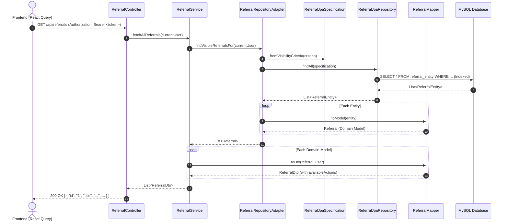

# Backend Data Architecture & Persistence Reference

## 1. Database Entity Structures & ORM/JPA Patterns

The backend follows Domain-Driven Design (DDD) with a clean separation between pure domain aggregates (`model/`) and database entities (`entity/`).

### Entity Definition Standards
- **Primary Keys**: Mapped to `BIGINT UNSIGNED` primary keys using `@Id @GeneratedValue(strategy = GenerationType.IDENTITY)` and typed as `var id: Long? = null`.
- **Table Indexes**: Explicit indexes defined on composite query paths (e.g., `@Table(name = "referral_entity", indexes = [Index(name = "idx_referral_student_status", columnList = "student_id, status")])`).
- **Audit Timestamps**: `createdAt: LocalDateTime = LocalDateTime.now()`.

### Enum Persistence via JPA AttributeConverters
Native MySQL `ENUM` columns are strictly avoided. All domain enums are persisted as 1-based integer ordinals (`Int`) via `@Converter(autoApply = true)` in [EnumConverters.kt](file:///Volumes/Files/Programming/medical-system/backend/src/main/kotlin/com/medicalsystem/backend/converter/EnumConverters.kt):

```kotlin
inline fun <reified E : Enum<E>> getEnumFromId(id: Int?): E? =
    if (id == null) null else enumValues<E>().getOrNull(id - 1)

inline fun <reified E : Enum<E>> getIdFromEnum(e: E?): Int? =
    if (e == null) null else e.ordinal + 1

@Converter(autoApply = true)
class ReferralStatusConverter : AttributeConverter<ReferralStatus, Int> {
    override fun convertToDatabaseColumn(attribute: ReferralStatus?) = getIdFromEnum(attribute)
    override fun convertToEntityAttribute(dbData: Int?) = getEnumFromId<ReferralStatus>(dbData)
}
```

### Complex Collections & Relationships
- **Value Object Collections**: `@ElementCollection` with dedicated join tables (e.g., `referral_clinical_status`, `referral_severe_risk_factors`).
- **Embedded Structures**: `@Embedded` for grouping related columns (e.g., `destination: ReferralDestinationEntity?`).
- **Entity Associations**:
  - `@OneToMany(mappedBy = "...", cascade = [CascadeType.ALL], orphanRemoval = true, fetch = FetchType.LAZY)`
  - `@OneToOne(mappedBy = "...", cascade = [CascadeType.ALL], orphanRemoval = true)`
- **Lazy Foreign Key Assignment**: Repository adapters use `entityManager.getReference(EntityClass::class.java, id)` to bind foreign keys without issuing unnecessary `SELECT` queries.

---

## 2. Repository Architecture & Adapter Pattern

The persistence layer isolates domain logic from Spring Data JPA via the **Repository Adapter Pattern**:

```text
Service / Domain Layer
       │
       ▼
Domain Repository Interface (e.g. ReferralRepository)
       │
       ▼
Repository Adapter (e.g. ReferralRepositoryAdapter)
  ├── ReferralJpaRepository (Spring Data JpaRepository + JpaSpecificationExecutor)
  ├── ReferralJpaSpecification (Dynamic row-level security & filters)
  └── ReferralMapper (Entity <-> Model conversion)
```

### 1. Pure Domain Repository Interface
Declares operations using pure domain models, completely agnostic of JPA:

```kotlin
interface ReferralRepository {
    fun findById(id: Long): Optional<Referral>
    fun findVisibleReferralsFor(user: User): List<Referral>
    fun save(referral: Referral): Referral
}
```

### 2. Spring Data JPA Interface
Extends Spring Data interfaces for query execution:

```kotlin
@Repository
interface ReferralJpaRepository : JpaRepository<ReferralEntity, Long>, JpaSpecificationExecutor<ReferralEntity>
```

### 3. Visibility Specifications (`JpaSpecification`)
Row-level access controls are translated from domain visibility policies into JPA Criteria specifications:

```kotlin
override fun findVisibleReferralsFor(user: User): List<Referral> {
    val criteria = ReferralVisibilityPolicy.getVisibilityCriteria(user)
    val spec = ReferralJpaSpecification.fromVisibilityCriteria(criteria)
    return jpaRepository.findAll(spec).map { mapper.toModel(it) }
}
```

---

## 3. DTO Creation & Data Transfer Patterns

DTOs in `com.medicalsystem.backend.dto` represent client-facing contracts.

### Request DTOs
Enforce input validation with Jakarta Bean Validation (`@field:NotBlank`, `@field:NotNull`, `@Valid`):

```kotlin
data class CreateReferralDto(
    @field:NotNull(message = "Student ID is required")
    val studentId: Long,

    @field:NotBlank(message = "Title is required")
    val title: String,

    @field:NotBlank(message = "Description is required")
    val description: String,

    val type: ReferralType = ReferralType.INITIAL,
    val riskLevel: RiskStatus = RiskStatus.LOW
)
```

### Response & Composite DTOs
Expose formatted output suitable for UI consumption:
- **`ReferralDto`**: Summary item for list views. Includes `availableActions: List<String>` calculated dynamically based on caller role and workflow state.
- **`ReferralDetailsDto`**: Composite view combining base referral info, student demographics, triage details, risk assessments, and doctor feedback.
- **`StudentDto`**: Student profile with demographics, current academic year, and risk status.

---

## 4. Converter & Mapper Implementations

Mappers in `com.medicalsystem.backend.mapper` are Spring `@Component` beans responsible for three-way translations:

```text
Database Entity  ◄────(toModel / toEntity)────►  Domain Aggregate  ◄────(toDto)────►  REST DTO
```

### Mapper Responsibilities
1. **`toModel(entity: Entity): DomainModel`**: Hydrates domain aggregates with value objects, step collections, and child entities.
2. **`toEntity(model: DomainModel): Entity`**: Converts domain aggregates into JPA entities with cascaded associations.
3. **`toDto(model: DomainModel, user: User?): Dto`**: Projects domain models to DTOs, evaluating role-specific action availability.
4. **`toDetailsDto(...)`**: Assembles composite responses across multiple repository sources.

---

## 5. End-to-End Flow: Querying, Mapping, and Returning Data



### Step-by-Step Implementation Recipe for New Endpoints:
1. **Entity (`entity/`)**: Define the JPA entity with `@Entity`, integer-converted enums, and proper indexes.
2. **Domain Model (`model/`)**: Define the pure domain model and business methods.
3. **Repository (`repository/`)**:
   - Create domain interface `XRepository`.
   - Create Spring Data interface `XJpaRepository`.
   - Implement `XRepositoryAdapter` delegating JPA calls and converting via `XMapper`.
4. **Mapper (`mapper/`)**: Implement `toModel()`, `toEntity()`, and `toDto()`.
5. **Service (`service/`)**: Coordinate business transactions, evaluate domain permissions, and return DTOs.
6. **Controller (`controller/`)**: Expose `@RestController` endpoints with `@CurrentUser` security injection and Jakarta `@Valid`.
